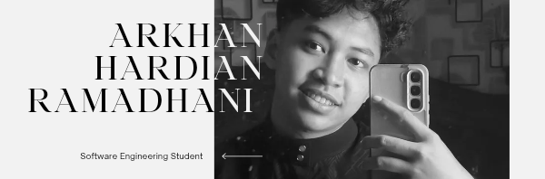

  

<h1 align="center">Hi 👋, I'm Arkhan Hardian Ramadhani</h1>

<h3 align="center">
Front-End Web Developer • Software Engineering Student
</h3>

  

## Tentang Saya

🎓 Lulusan **SMK Negeri 4 Bojonegoro** jurusan **Rekayasa Perangkat Lunak (RPL)**

💼 Menyelesaikan **program magang selama 6 bulan di PT Humma Teknologi Indonesia** sebagai **Front-End Web Developer**

🤝 Berpengalaman bekerja sama dalam tim pengembangan untuk membangun aplikasi web yang responsif dan ramah pengguna

🌱 Saat ini sedang mempelajari **Laravel** dan terus mengeksplorasi teknologi pengembangan web modern

💡 Memiliki minat besar dalam menciptakan antarmuka yang bersih, interaktif, dan menarik secara visual

## Teknologi yang Saya Gunakan

  

## Pengalaman

### Front-End Web Developer Intern
**PT Humma Teknologi Indonesia**

- Mengembangkan antarmuka web yang responsif
- Berkolaborasi dengan developer dan desainer dalam lingkungan kerja tim
- Membangun komponen UI yang dapat digunakan kembali
- Meningkatkan responsivitas website dan pengalaman pengguna
- Menggunakan HTML, CSS, JavaScript, React, Tailwind CSS, dan Bootstrap dalam pengembangan aplikasi

## Fokus Saat Ini

- ⚛️ Memperdalam Ekosistem React
- 🎨 Pengembangan UI / UX
- 🚀 Optimasi Performa Front-End
- 🌐 Teknologi Web Modern
- 📚 Mempelajari Dasar-Dasar Laravel

## Statistik GitHub

<table align="center">
<tr>
<td>

</td>
<td>

</td>
</tr>
</table>

## Aktivitas GitHub

  

## Animasi Kontribusi

  

  <i>"Membangun antarmuka yang indah dan menghadirkan pengalaman pengguna yang bermakna."</i>

  Terima kasih telah mengunjungi profil saya!

